# Customers Minecraft Mod for NeoForge


## Overview

This mod provides Customer Villagers that will spawn, decide they want to buy some items from you,
and go to where they think they can buy them from you.  Once you sell the items to them they will
pay you, say thank you, and go on their merry way.  It provides the basic villager AI, spawning blocks,
and controls to crafter and customer type gameplay experiences like a fast-paced diner or a cozy
rode-side farm stand.

This has been a big passion project.  If you enjoy this mod, think about buying me a coffee to fuel
me adding more features:

[](https://www.buymeacoffee.com/clubycoder)


## Supported Minecraft Versions

For now we support Minecraft versions:
* 1.20.1 - Forge
* 1.21.1 - Forge & NeoForge
* 1.21.11 (delayed update)

## Mod Loader

For now we are only supporting NeoForge.

## Customer Spawner Blocks

A customer spawner block is the starting point for this mod.  Where you place it is where your
customers will spawn and what you place inside of it determines what your customers will want to
buy from you.

Customers only spawn where they have enough vertical clearance and a 2x2 surface made from solid
blocks, slabs, carpet, or stairs.

Open the Customer Spawner interface and change its **Max** setting to control the maximum number
of customers for that individual spawner. Customers that are done buying and are leaving do not
count toward this maximum.

Breaking a customer or supplier spawner that still contains items asks for confirmation. Cancel or
press Escape to keep the configured spawner in place.

During timed shifts, the customer maximum starts low, ramps up to the spawner's configured
maximum, and ramps down over the final portion of the shift. The longer
Day and Night Shifts ramp up more gradually than the shorter meal shifts.


### Crafting Customer Spawner Blocks

You can craft a customer spawner block from a bed surrounded by 8 emeralds.

### Spawning Modes

The customer spawning modes are mostly around time or shifts, do you configure the spawning mode
with a Clock.  Hold a Clock and right-click the customer spawner block to cycle through the
spawning modes.  Each spawning mode change will show a message with the change and change the
block texture.

* Continuous / Default - The default mode will try to continuously keep 4 customers spawned.
* Day Shift - This mode will keep spawning customers, but only when it's daytime from
  5am - 7pm.
* Night Shift - This mode will keep spawning customers, but only when it's nighttime from
  7pm to 5am.
* Breakfast Shift - This mode will keep spawning customers from 5:30am - 10:30am -
  A little over 4 minutes.
* Lunch Shift - This mode will keep spawning customers from 11:30am - 3:30pm -
  Just under 3 1/2 minutes.
* Dinner Shift - This mode will keep spawning customers from 4:30pm - 9:00pm -
  Just under 4 minutes.
* Manual - This mode only spawns manually with a redstone pulse.

For the time restricted shift modes, the players within 64 blocks of the spawner will get
shift messages, progress bars, and a results screen showing the final score, customer totals,
total items crafted and served, and each participating player's crafted and served item counts.
The star beside a player is their served item count, while the spoon is their crafted item count.
The progress bar shows every item currently
requested, grouped by customer with yellow for normal customers, red for impatient customers,
and green for casual customers.

### Redstone and Customer Spawner

Similar to a hopper, if the Customer Spawner block is in any mode other than Manual and
is receiving power, it will turn off spawning.  This will allow you to turn off getting
new customers when you don't want to deal with them or if you want to use redstone to control
when the shifts are on.

If a Customer Spawner is in Manual mode, a redstone pulse like with a button will spawn a
customer.  This will let you completely customize the spawning with your redstone contraption.


### Controlling Items For Purchase

To control the items the customers can purchase the customer spawner block also acts like
a container like a chest.  The items or stacks of items you put in the spawner are what
the customers can randomly decide to purchase.

The size of the stack is the limit to how many of that item a customer can ask to buy.
For example if you have put a single apple in the customer spawner the customer will only
ask to buy a single apple.  However, if you put a stack of 5 apples in the customer spawner,
the customer will decide to randomly buy 1 to 5 apples.

The separate 6 rows in the spawner container are used to define how many different items
a customer can decide to buy and what each of those items can be.  Each of the 6 container
rows is a "slot" for a customer to decide to buy from. The first 8 columns on each row
define the items a customer can ask to buy from that row. A customer will only
ask for one item per slot, and it will randomly decide how many slots to buy from from 1 to
the number of rows you have items in.

The 9th column is the **Cost** column for its row. The item and count in that slot are the
price for the full stack configured in the selected sell slot. If a customer randomly asks
for fewer items, the payment is reduced by the same sell-item-to-cost ratio and rounded down,
with a minimum payment of one cost item. For example, if 5 apples cost 2 emeralds, a customer
asking for 3 apples pays 1 emerald.

The maximum number of customers is not controlled by an inventory item. Use the **Max**
setting in the Customer Spawner interface to set a value from 1 through 99 for that
spawner.

Examples:
* Row 1 contains just a single apple - Customer will always ask for a single apple and
  pay a single emerald
* Row 1 contains a stack of 5 apples with a single emerald in its Cost slot - Customer will
  ask for 1 to 5 apples and pay one emerald.
* Row 1 contains a stack of 5 apples and a stack of 5 carrots - Customer will always
  decide to buy either apples or carrots and buy from 1 to 5 of them. The Cost slot sets
  the full-stack price for whichever item is chosen.
* Row 1 contains a stack of 3 chocolate chip cookies and a single pumpkin pie in its first
  8 columns, with a stack of 2 emeralds in its 9th-column Cost slot - Customer will always
  decide to buy chocolate chip cookies or a pumpkin pie.
  If it decides to buy all 3 chocolate chip cookies it pays 2 emeralds; smaller cookie offers
  are scaled down to a minimum of 1 emerald. If it decides to buy the pumpkin pie it pays
  2 emeralds.
* Row 1 contains a single apple. Row 2 contains a single pumpkin pie in its first 8 columns
  and a stack of 2 emeralds in its Cost slot - Customer will decide to buy from 1 to 2
  items. If it decides to only buy 1,
  it will randomly pick which row to buy from.  If it decides to buy 2, it will buy one
  item from each row.


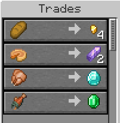

The Customer Spawner UI is also where you can chnge the spawner mode, set the max customers,
and enable different customer appearances.

### Counter or Table-Top Blocks

Once a customer spawns, it needs to know where to go to buy the items it picked.  This is
where the counter or table-top blocks come in.  Whatever item you place on top of the
spawner will be treated as the counter or table-top block to find.  A good approach would
be to use colored carpet blocks that you are not using on the floor or other parts of your
build and put that same carpet color on the tables or counters where you want the customers
to go.  You can also use a sign with custom text that you match on the sign next to your
counter where you want customers to gather.

* Carpet or wool blocks - Matches the type and color
* Signs - Matches the wood type and text
* Containers or banners named with an anvil - Matches the block type and name
* Lecterns with a named book on them - Matches the book name
* Other items - Exact block match

Customers search for all blocks of this type within 64 blocks by default and go to a random one,
trying to avoid one that already has a customer next to it. The search distance can be changed
with the `maxCounterDistance` configuration option.

In your builds you can use full blocks as the counter or table itself:

| Spawner Setup | Build |
|--------------|-------|
| 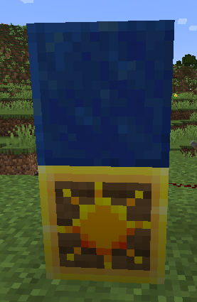 | 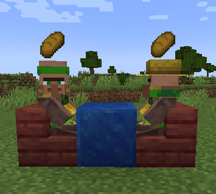 |

a topper block like carpet of candle:

| Spawner Setup | Build                                                 |
|---------------|-------------------------------------------------------|
| 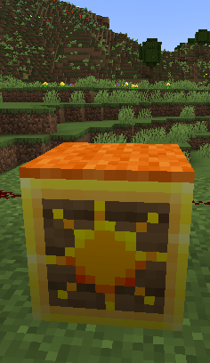 | 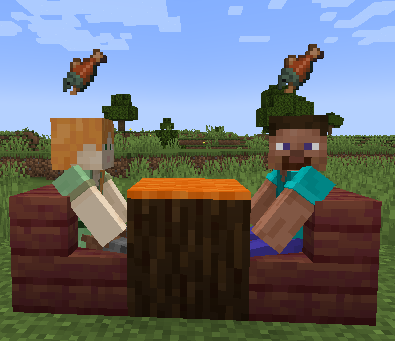 |

or even custom blocks provided by other mods like furniture:

| Spawner Setup | Build                                                  |
|---------------|--------------------------------------------------------|
| 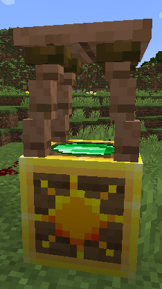 | 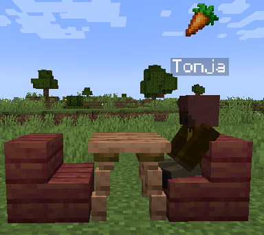  |

### Avoid Block

When a Customer looks for a spot to go to next to your counter or table-top blocks it will
look at all the spaces around it as options unless that block matches the block directly
under the customer spawner block.  This can be used to set of builds like a counter where
you only want the customers to go to one side of it because the other side if the kitchen.
On the other side of the counter use a different block for the kitchen tiles and put that
same kitchen floor block under the customer spawner.
If avoiding that block leaves no valid positions around the matching counters, Customers
ignores the avoid block so the customer can still be served.

Customers normally allows any non-air block under a Customer Spawner to be used as the
avoid block. By default, dirt, grass blocks, sand, and snow cannot be used as avoid blocks.
These blocks are common around builds and can otherwise cause unexpected customer routing
when an avoid block was not deliberately set up.

Players can override these rules with a normal Minecraft data pack. Create the following
file inside a data pack placed in the world's `datapacks` folder:

```text
your-data-pack/
├── pack.mcmeta
└── data/
    └── customers/
        └── tags/
            └── block/
                └── can_avoid.json
```

For example, this `can_avoid.json` explicitly allows grass blocks and dirt to be used as
avoid blocks, overriding Customers' default protection:

```json
{
  "replace": false,
  "values": [
    "minecraft:grass_block",
    "minecraft:dirt"
  ]
}
```

Mods can provide the same override by including
`data/customers/tags/block/can_avoid.json` in their resources. Keep `"replace": false` so
the mod or data pack adds to the existing tag instead of replacing other entries.

Data packs and mods can add blocks to `customers:can_not_avoid` to prevent them from being
used as avoid blocks. `customers:can_avoid` always takes priority. For example, this
prevents stone from being used:

```json
{
  "replace": false,
  "values": [
    "minecraft:stone"
  ]
}
```

## Customer Pickup Counter Blocks

Customer Pickup Counter Blocks let players split up the work of preparing and serving
customer orders. One player can prepare food or other requested items and place them on
a pickup counter while another player serves the waiting customers, or customers stationed
at pickup counters can collect their prepared items directly.

Placing or dropping a requested item on a pickup counter gives crafting credit to the
player who prepared. Items added by a hopper or without a known player are credited to **Automated**.

Each pickup counter holds up to 9 item stacks. The stored items are displayed on top
of the block, so players can see what is ready without opening an inventory screen. Items
are handled in first-in, first-out order: the item that has been waiting the longest is
the first one taken from the counter.


### Crafting Customer Pickup Counter Blocks

Craft a pickup counter with a horizontal row containing one iron ingot followed by two
matching variant ingredients:

```text
Iron Ingot | Variant Ingredient | Variant Ingredient
```


The following variants are available:

* Iron, made with two additional iron ingots
* Copper, made with two copper ingots
* Gold, made with two gold ingots
* Oak, spruce, birch, jungle, acacia, dark oak, mangrove, and cherry, made with two
  matching stripped logs
* Crimson and warped, made with two matching stripped stems
* Bamboo and stripped bamboo, made with two matching full bamboo blocks

Each variant uses the matching block texture, so pickup counters can be coordinated with
the materials and decoration used in a kitchen, restaurant, shop, or market stand.


### Placing and Taking Items

Right-click a pickup counter while holding an item stack to place the entire held stack
onto the counter. Sneak-right-click while holding a stack to place only one item. Right-click
with an empty hand to take the entire oldest stack. The counter does not open an inventory
screen; all item handling happens directly through these interactions.

Pickup counters accept only items currently wanted by active customers. Existing matching
items anywhere in the connected counter network count toward that demand. If customers
want only part of a held stack, that portion is placed on the counter and the rest remains
in the player's hand. If no active customer wants the held item, the pickup counter allows
the item's normal block interaction instead. This lets players hoppers and other blocks
against a pickup counter.

Dropped items resting on top of a pickup counter are accepted using the same rules. If the
item was dropped by a player, that player receives the crafting and serving credit. Items
without a known player are credited to **Automated**.

Hoppers, ownerless dropped items, and compatible automation accept demand only from Customer
Spawners assigned to that kind of pickup counter. They can insert wanted items into a pickup
counter but cannot extract prepared customer orders. Unwanted items and portions that do not
fit remain outside the counter.

Customers spawned from a Customer Spawner that is assigned a Pickup Counter as the counter/table
block will try to pick up the items they want from the Pickup Counter.

Empty containers such as bottles, buckets, and bowls are returned to the player credited for
each consumed portion. If that player is unavailable or the item was supplied by automation,
the containers are dropped on top of the pickup counter.

Payments for player-prepared orders are added to that player's inventory or dropped when
their inventory is full. For Automated orders or when the credited player is unavailable,
the customer tries nearby Customer Payment Boxes from nearest to farthest. A payment box is
used only when it can hold the entire payment. If no payment box within a 64x64x64 area
can hold it, the customer drops the payment.

If all 9 spaces are occupied, the item remains in the player's hand and a message explains
that the pickup counter is full.

Once each second, one pickup counter validates the entire connected network against all
nearby active customer demand. Excess items are returned to the player who placed them.
If that player's inventory is full, the remaining items are dropped on top of the pickup
counter and the player receives a message. Automated items and items whose player is
unavailable are dropped on top of the pickup counter instead. The original player or
Automated crafting credit is kept when items are first accepted.

### Connecting Pickup Counters

Pickup counters that touch on their north, south, east, or west sides work together as one
larger pickup area. Diagonally placed counters and counters above or below each other are
not connected.

When a player places an item on a full counter, the item is passed to an available connected
counter. This continues through an entire connected row or group of counters until a space
is found. Customer demand and stored quantities are also calculated across the complete
network. If every connected counter is full, the item stays in the player's hand.

When a player tries to take an item from an empty counter, it searches its connected
neighbors and returns the oldest available item it finds. This lets players add and collect
prepared items from a convenient end of a long pickup counter without interacting with
each individual block.

## Customer Payment Boxes

Customer Payment Boxes are compact containers for collecting and storing payments. Each
box has 27 inventory slots and opens with a right-click regardless of which item the player
is holding. The box faces the player when placed on a floor or ceiling. When placed against
the side of another block, its front faces away from that block.

Payment boxes work as standard containers. Hoppers, droppers, comparators, and compatible
automation from other mods can insert, extract, or measure their contents. Breaking a
payment box drops both the box and every item stored inside it.

### Crafting Customer Payment Boxes

Craft a payment box with a gold ingot at the top center, an emerald at the center, and
matching variant ingredients in every other crafting-grid position:

| Variant Ingredient |     Gold Ingot     | Variant Ingredient |
|:------------------:|:------------------:|:------------------:|
| Variant Ingredient |      Emerald       | Variant Ingredient |
| Variant Ingredient | Variant Ingredient | Variant Ingredient |

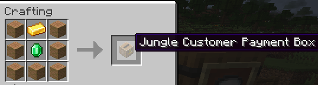

The following variants are available:

* Iron, made with iron ingots
* Copper, made with copper ingots
* Gold, made with gold ingots
* Oak, spruce, birch, jungle, acacia, dark oak, mangrove, and cherry, made with matching
  stripped logs
* Crimson and warped, made with matching stripped stems
* Bamboo and stripped bamboo, made with matching full bamboo blocks

Each payment box uses the matching block texture beneath its payment-box detailing.

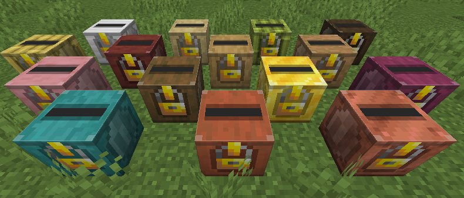

## Villager Customers

The Customer Spawner will spawn Customer Villagers that are just normal villagers with
custom AI and a custom profession.  The Customer profession give them a unique skin and
hat so you can tell they are customers.  There are 3 types of customers:

* Normal - ~50% of spawned - Will give up at the configured max seconds.
* Impatient - ~ 20% of spawned - Will give up at half of the configured seconds.
* Casual - ~30% of spawned - Will never give up.

Each wears a different hat:

|                       Normal                        |                         Impatient                         |                       Casual                        |
|:---------------------------------------------------:|:---------------------------------------------------------:|:---------------------------------------------------:|
|  |  |  |


If you want your customers to have names, think about using the [Villager Names mod](https://www.curseforge.com/minecraft/mc-mods/villager-names).

### Picking Items to Buy

The first thing a customer will do it look at it's spawner to pick what items it wants to
buy.  See [Controlling Items For Purchase](#Controlling Items For Purchase).

### Going to the Counter or Table

Once it has picked items to buy, it needs to find where to buy them.
See [Counter or Table-Top Blocks](#Counter or Table-Top Blocks).
Once the customer has found all the matching blocks, it will shuffle the list and then
sort it ascending by the number of customers within 2 blocks of it.  It will then pick
the first one which should be a random block with the fewest number of other customers
near it.  This should give a nice pattern of filling our a counter or restaurant full
of tables.
Customers prioritize available stairs and seat-like blocks near counters and will sit while waiting to be served.


If there are more customers than there are counters, the customers will line up and
wait their turn:


### Serving and Selling to the Customer

You will serve the customer what they want or sell them what they want to buy just like
any other villager trader.  Right click on them to open up the trade and sell them one
of the items.  After being sold one of the items they want, that item will be removed
from the trades.

Quick selling can be enabled with the `enableQuickSell` configuration option. When enabled,
right-clicking a customer while holding enough of a wanted item in your main hand immediately
completes one matching sale instead of opening the trading screen.

### Thank You and Goodbye

Once the customer's trade list is empty they will say thank you and goodbye to you in
chat and walk back to the spawner that created them.  Once they reach the spawner they
will pick a random block to walk to 32 blocks away that has 2 air blocks above it and
that they can actually path to.  They will then walk to this block and once they get
there despawn.

## Customer Pets

Customer Spawners can give some customers a small pet that follows them around while
they are visiting. Pets are chosen from animal entity types that accept at least one
registered item as food. Customers with pets get one extra trade for their pet's food.
That extra trade asks for 1 of the pet food item and uses the item in the upper-right
slot of the Pets panel as its payment. Leave that slot empty to pay one emerald.

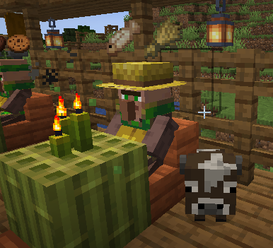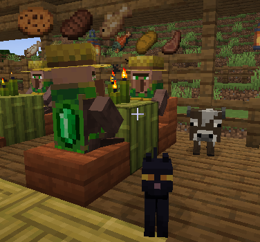

Pets can even be additional animals from mods like Animal Garden:

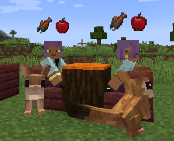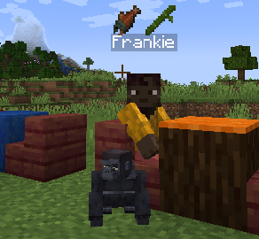

Pets disappear when their customer leaves, dies, or is no longer tracked by the spawner.
When a player gives the customer the pet's food, the pet shows heart particles.

Open the Customer Spawner interface and use the **Pets** percentage setting to control
how often spawned customers have pets. The value is set per spawner level. `0%` means
customers from that level never have pets, and `100%` means every customer from that
level tries to have a pet.

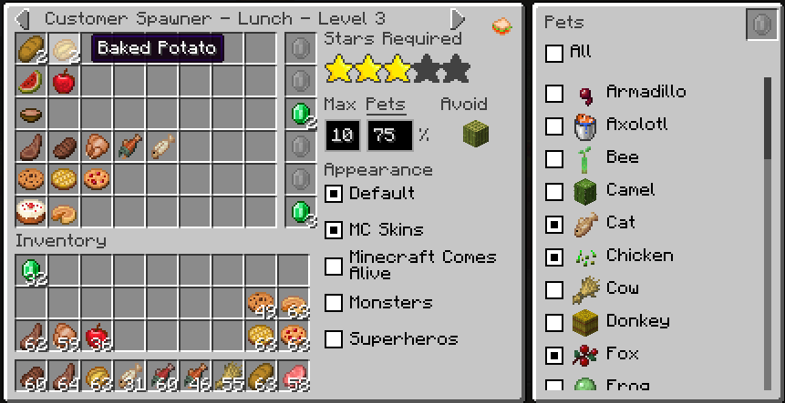

Click the underlined **Pets** label in the Customer Spawner interface to open the pet
type list for the selected level. Each discovered pet type has a checkbox. By default,
all discovered pet types are enabled for each level. Turning off a pet type prevents
that level from choosing it, and turning off every pet type means customers from that
level will not spawn pets even when the **Pets** percentage is above `0%`.
The **All** checkbox selects or clears every discovered pet type for the level. Click a
pet's food icon to cycle through every item that pet accepts as food. The selected food
is saved for that level and becomes the customer's extra pet-food trade.

Server owners can prevent specific animals from being used as customer pets with a normal
Minecraft data pack. Create the following file inside a data pack placed in the world's
`datapacks` folder:

```text
your-data-pack/
├── pack.mcmeta
└── data/
    └── customers/
        └── tags/
            └── entity_type/
                └── can_not_be_pet.json
```

For example, this `can_not_be_pet.json` prevents cats and wolves from being selected as
customer pets:

```json
{
  "values": [
    "minecraft:cat",
    "minecraft:wolf"
  ]
}
```

## Appearances

The appearance of Customers and Suppliers is extensible. An appearance controls how
those villagers are rendered and which ambient, hurt, death, step, successful-trade,
and invalid-trade sounds they use.
Each spawner can enable the appearances its villagers may use.  Open the spawner UI
to enable or disable differences.

Appearances can customize these sounds:

* **Ambient** - Played periodically while the Customer or Supplier is nearby.
* **Hurt** - Played when the Customer or Supplier takes damage.
* **Death** - Played when the Customer or Supplier dies.
* **Step** - Played while the Customer or Supplier walks.
* **Yes** - Played after a successful trade and when the items in a trade interface
  satisfy an available trade.
* **No** - Played when the items in a trade interface do not satisfy an available
  trade.

Each sound override is optional. When an appearance does not provide a sound,
the normal Villager sound for that action is used.

### Default Appearance

The Default appearance uses vanilla Villager rendering and sounds with custom textures
that distinguish Suppliers, normal Customers, impatient Customers, and casual Customers.
The Default appearance is enabled initially.

### Monsters Appearance

The Monsters appearance makes Customers look and sound like friendly monsters while
preserving their normal customer behavior, including sitting while waiting. It uses the
customer's saved appearance variation to consistently select a zombie, skeleton, witch,
husk, drowned, or stray. Enable Monsters in a Customer Spawner's appearance list to make
it available in any spawning mode.

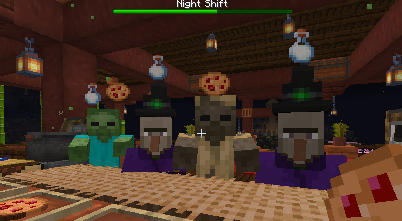

### Skins

Skin packs are data-driven appearances that use standard Minecraft player skins. Each
skin-pack JSON becomes a separately selectable appearance in Customer and Supplier
Spawner interfaces. When a skin-pack appearance is selected for a villager, its saved
appearance variation consistently selects one of the skins in that pack.

The mod includes an **MC Skins** appearance containing Alex, Ari, Efe, Herobrine,
Makena, Steve, and Zuri.

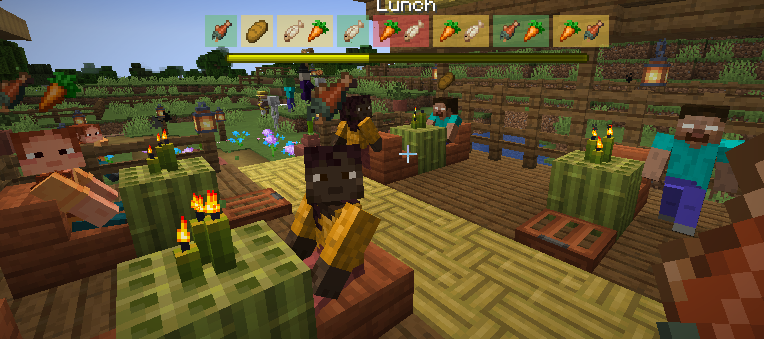

A skin pack uses synchronized data-pack definitions together with client resource-pack
textures and optional sounds:

When distributing a skin pack as one combined ZIP, install it in the world's `datapacks`
folder for the skin definitions and in the client's `resourcepacks` folder for its
textures and sounds. Enable the resource-pack copy from Minecraft's Resource Packs menu.

```text
data/{namespace}/customers/skin_packs/{pack}.json
data/{namespace}/customers/skins/{skin}.json

assets/{namespace}/textures/customers/skins/{texture}.png
assets/{namespace}/textures/customers/skins/{texture}.png.mcmeta

assets/{namespace}/sounds/customers/skins/{sound}.ogg
assets/{namespace}/sounds.json
```

For example, this file defines an appearance named **Example Skins**:

**data/example/customers/skin_packs/example.json:**
```json
{
  "name": "Example Skins",
  "skins": [
    "example:steve",
    "example:alex"
  ]
}
```

Each referenced skin has its own definition. Steve uses the standard wide-arm player
model:

**data/example/customers/skins/steve.json:**
```json
{
  "texture": "example:steve",
  "model": "wide"
}
```

Alex uses the slim-arm player model and demonstrates the optional rendering and sound
settings:

**data/example/customers/skins/alex.json:**
```json
{
  "texture": "example:alex",
  "model": "slim",
  "scale": 0.9375,
  "shadow_radius": 0.5,
  "name_tag_offset": 0.0,
  "sounds": {
    "ambient": "example:alex_ambient",
    "hurt": "example:alex_hurt",
    "death": "example:alex_death",
    "step": "example:alex_step",
    "yes": "example:alex_yes",
    "no": "example:alex_no"
  }
}
```

The texture IDs in those definitions resolve to:

```text
assets/example/textures/customers/skins/steve.png
assets/example/textures/customers/skins/alex.png
```

Standard `.png.mcmeta` files can animate modern 64×64 skins. A legacy 64×32 skin can
set `"legacy": true`; legacy skins are converted at runtime and cannot be animated.

Every sound is optional. A missing sound uses the normal Villager sound for that action.
Custom sounds use Minecraft's standard `sounds.json` system. For example:

**assets/example/sounds.json:**
```json
{
  "alex_ambient": {
    "sounds": [
      "example:customers/skins/alex_ambient"
    ]
  },
  "alex_hurt": {
    "sounds": [
      "example:customers/skins/alex_hurt"
    ]
  },
  "alex_no": {
    "sounds": [
      "example:customers/skins/alex_no"
    ]
  },
  "alex_death": {
    "sounds": [
      "example:customers/skins/alex_death"
    ]
  },
  "alex_step": {
    "sounds": [
      "example:customers/skins/alex_step"
    ]
  },
  "alex_yes": {
    "sounds": [
      "example:customers/skins/alex_yes"
    ]
  }
}
```

Those entries load OGG files from:

```text
assets/example/sounds/customers/skins/alex_ambient.ogg
assets/example/sounds/customers/skins/alex_hurt.ogg
assets/example/sounds/customers/skins/alex_death.ogg
assets/example/sounds/customers/skins/alex_step.ogg
assets/example/sounds/customers/skins/alex_yes.ogg
assets/example/sounds/customers/skins/alex_no.ogg
```

Sound definitions may use normal Minecraft `sounds.json` features such as multiple
weighted variants, volume, pitch, subtitles, streaming, and replacement. Skin packs
with IDs that conflict with code-defined appearances are ignored in favor of the
code-defined appearance.

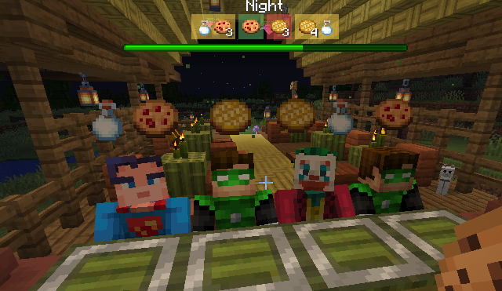

### Minecraft Comes Alive Appearance


The [Minecraft Comes Alive](https://www.curseforge.com/minecraft/mc-mods/minecraft-comes-alive-reborn) appearance is supported for Minecraft 1.21.1 and
newer only, with MCA Reborn version 7.7.9 or newer for Minecraft 1.21.1. When
Minecraft Comes Alive Reborn is installed on a supported version, the appearance
becomes available in Customer and Supplier Spawners. It uses
MCA's human villager models, genetics, skin layers, clothing, hairstyles, and
configured villager voices, including its yes and no trade responses, while
preserving normal Customer and Supplier behavior, including sitting while
waiting. The saved appearance variation keeps each villager's MCA appearance
consistent. Customers and Suppliers using this appearance are always rendered
as adults. The Minecraft 1.20.1 Forge build does not include this appearance.

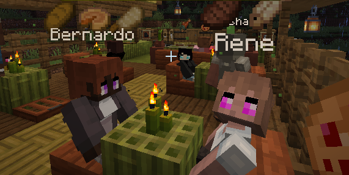

### Creating a Custom Appearance

The Customers Appearance system is extensible by other mods creating and
registering their own appearance which will show up as a new option in
the Customer or Supplier Spawner UI.

Check out [this example and tutorial](https://github.com/vikingkittensgames/mc-mod-customers-example-appearance).

## Gameplay and Shifts

If your Customer Spawner Block is ser to a mode other than Continuous and Manual,
you and other players will be working within shifts that have a start and end.  You
will get a progress bar that shows the shift, a progress bar that ticks down to the
end, and a heads up view of what all active customers want for that shift.


At the end of a shift where at least one player or Automated system crafted or served an
item, you and the other players will get a scoreboard showing how well you did. Automated
activity appears with redstone as its profile image. Along with the number of stars earned
for that shift, the scoreboard shows a green checkmark when you earned enough stars to pass
the current level:


### Levels and Leaderboards

Customer Spawner Blocks support a progression of levels, with each level configured in the
Customer Spawner UI. Each level has a required number of stars, and the Customer Leaderboard
stores players' previous shift scores to determine which level a spawner should use.

#### Configuring Levels

You can configure up to eight levels in the Customer Spawner UI. Each level has its own
inventory of items customers want to buy, maximum number of customers, enabled appearances,
and number of stars required to pass the level.

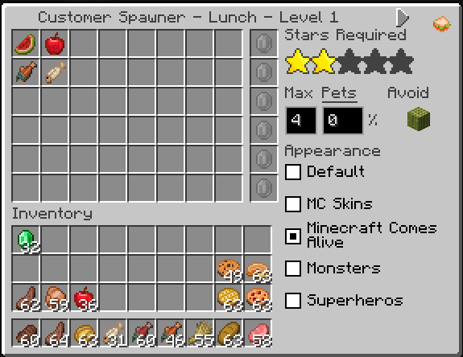

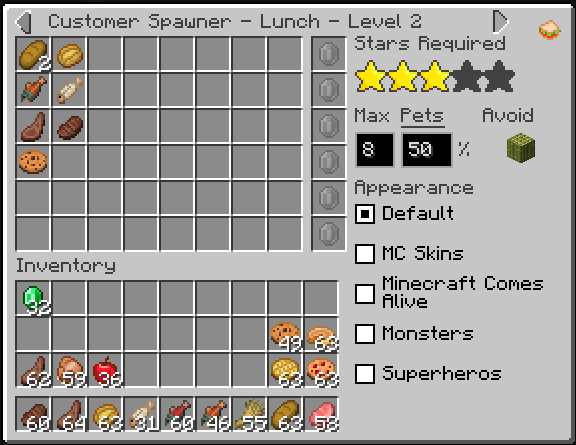

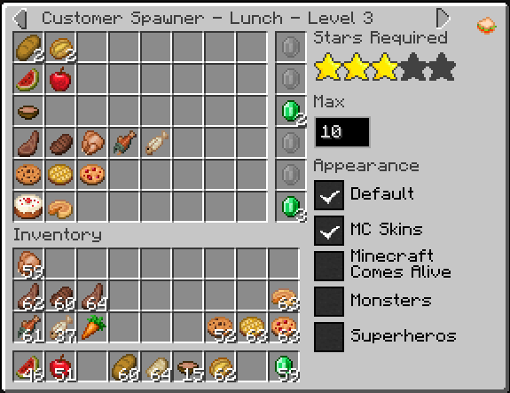

Use earlier levels for simpler shifts with fewer item options, easier items to craft, and
fewer customers. Later levels can increase the variety and complexity of requested items
and raise the maximum number of customers. When a shift starts, the Customer Spawner reviews
all players in the area against the closest Customer Leaderboard and their saved scores. It
finds the lowest level those players should be on and uses that level for the shift.

#### Leaderboards

The Customer Leaderboard stores each Customer Spawner shift score by spawner, mode, level,
and player. Place a Customer Leaderboard in your build so players can see how they and others
are doing. It shows the stars each player earned for a level and a green checkmark when that
player has passed the level.

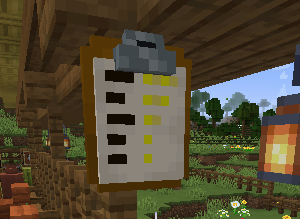

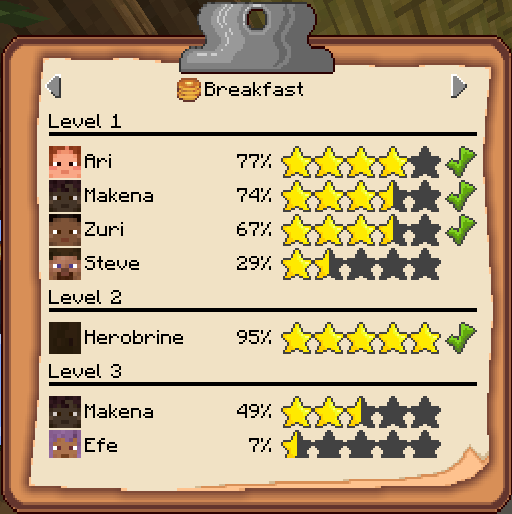

Craft a Customer Leaderboard with stripped logs around an iron ingot, paper, emerald, and
ink sac.

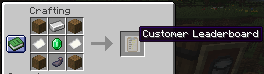

## Automation

Using Customer Pickup Counters and Customer Payment Boxes combined with some hoppers you
can automate a shop that customers can buy from.

* Setup your spawner with a Customer Pickup Counter above it as the counter/table block.
* Create your show and add at least one of the same Customer Pickup Counter block.
* In your shop add a Customer Payment Box.  This is where customers will drop their payments after they pickup their items.
* Add a hopper directed into your Customer Pickup counter block(s).
* Feed the items your customers want into that hopper like adding a barrel above it and filling it up.

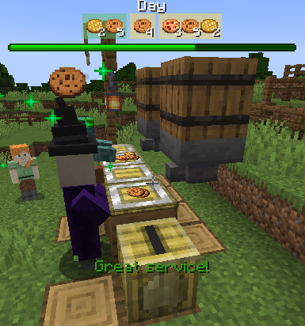

[automation1.mp4](screenshots/automation1.mp4)

As your customers spawn and head to your counter, the Customer Pickup Counter will recognize
what customers it is serving, get what items the customers want, and extract those items
from the hopper placing those items on the counter ready to pick up.  When the customer gets
there it will see the items it wants, take them, and drop the payment in the Customer Payment
Box.

Then you can break out your redstone skills or even work in the Create mod to automate the
crafting of the items before feeding them into the hopper, and maybe even using a comparator on
the hopper to know when it's empty to signal crafting more.

## Supplier Spawner Block

A Supplier Spawner Block can be used to setup a Supplier that will show up at the beginning
of the day will new supplies to buy for your restaurant or stand when you can't or don't
want to gather them your self.  Lets say your Customers want steaks, but you don't want
to harvest a bunch of cows.  That's where a Supplier can help you out.


### Crafting Supplier Spawner Blocks

You can craft a supplier spawner block from a barrel surrounded by 8 emeralds.

### Specifying What the Supplier Will Sell

The supplier spawner inventory has four pairs of slots on each row. Put the stack the
Supplier will sell in the first slot of a pair and its cost in the second slot. The full
stacks are used as entered, so a stack of 32 raw steaks followed by 5 emeralds makes an
offer of 32 raw steaks for 5 emeralds. The cost can be any item, not only emeralds.

The Appearance checkboxes select which appearances Suppliers from that spawner may use.
At least one appearance is always enabled.


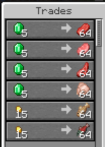

### Supplier Spawning

The Supplier will spawn each morning up to 64 blocks away from the spawner at a position
from which it can walk back to the spawner. Once the Supplier is there you can start buying items.

Suppliers only spawn where they have enough vertical clearance and a 24x24 surface made from solid
blocks, slabs, carpet, or stairs.

Once it is dark the Supplier will walk away and despawn.

## Economy and Item Cost Suggestions

Customers can suggest costs for Customer and Supplier Spawner offers. Automatic costs are
enabled globally by default, but each spawner starts in manual-cost mode. The small cost toggle
at the right edge of the player inventory switches the selected Customer Spawner level or the
Supplier Spawner between manual and automatic costs. The green dollar icon means the configured
Cost slots are used; the crossed-out icon means costs are generated automatically.

When automatic costs are active, the interface uses the automatic-cost background and displays
generated cost items where the Cost slots normally appear. These displayed items are previews,
not stored inventory. Editing a sell stack updates its preview through the server. Any items
already stored in disabled Cost slots are dropped on top of the spawner.

The server `forceAutoCost` config makes every Customer and Supplier Spawner use automatic costs and hides the
per-spawner cost toggle.

Turning off `enableEconomy` disables all cost suggestions, including
forced and per-spawner automatic costs, without changing the saved per-spawner choices.

Automatic providers are tried in this order:

1. Manual item-cost definitions from datapacks and server configuration
2. Village Shop System, when installed and enabled
3. ProjectE, when installed and enabled
4. Vanilla villager trades, wandering-trader trades, and crafting recipes
5. One emerald per item is the final fallback

### Manual Item Costs

Economy definitions can come from both datapacks and the server configuration directory. Datapacks
let modpack authors and server owners distribute an economy with a world or pack. Configuration
files provide a separate administrator-controlled layer, allowing an individual server to add or
override definitions without editing its installed datapacks. Both sources use the same JSON
format and are refreshed by `/reload`.

Datapack item-cost files belong at:

`data/<namespace>/customers/economy/items/<file>.json`

Server administrator files belong in:

`config/customers/economy/items/`

Splitting definitions into files such as `foods.json`,
`building_blocks.json`, and `modded_items.json` makes large economies easier to maintain without
changing their behavior.

Customers loads datapacks from lowest to highest pack priority, sorting files by resource ID
within each pack. It then loads configuration files alphabetically. Values normally merge, and a
later matching definition overrides an earlier definition. This lets a server configuration entry
override a distributed datapack value.

The optional root `replace` property defaults to `false`. When `replace` is `true`, Customers
discards every value accumulated from earlier files before adding that file's `values`. A
higher-priority datapack can therefore replace an economy supplied by a lower-priority pack, and a
server administrator can ignore all distributed definitions and maintain a strict local list.
Files processed after the replacing file can still add or override values normally. This explicit
reset is useful because otherwise an administrator would have to override every unwanted inherited
entry individually.

Each entry has exactly one vanilla-style `item` or `tag` matcher. `itemCount` describes the
priced batch and `costCount` describes its price; both default to 1. Calculated partial batches
round up. Cost items are ordinary item IDs and may be any item.

```json
{
  "replace": false,
  "values": [
    {
      "item": "minecraft:apple",
      "itemCount": 5,
      "costItem": "minecraft:emerald",
      "costCount": 2
    },
    {
      "tag": "minecraft:logs",
      "itemCount": 4,
      "costItem": "minecraft:gold_nugget",
      "costCount": 3
    }
  ]
}
```

Items that do not match continue to the next provider.

### Village Shop System and ProjectE

If you are already managing a server with other mods that manage an economy, we want to reduce
the duplicate work for you and try to base costs on what you already have.  Right now we support
integrating with the
[Villager Shop System](https://www.curseforge.com/minecraft/mc-mods/village-shop-system) mod and the
[ProjectE](https://www.curseforge.com/minecraft/mc-mods/projecte) mod.


When [Villager Shop System](https://www.curseforge.com/minecraft/mc-mods/village-shop-system) is installed and enabled,
we want to try and keep costs in sync with villager shops.
Customers uses its sell-price calculator and the
server's Village Shop System custom prices. Bulk villager ratios are rounded up to at least one
emerald when an individual stack would otherwise truncate to zero.


When [ProjectE](https://www.curseforge.com/minecraft/mc-mods/projecte) is installed and enabled,
We want to be in sync with the ProjectE item equivelancy system that you may
have made adjustments to.
Customers compares the stack's EMC value with ordinary wheat. The
standard Farmer trade of 20 wheat for one emerald converts that wheat-equivalent value into an
emerald cost. Items with no EMC value continue to the next provider.

Neither integration is a required dependency, and each can be disabled independently.

### Villager Trades and Recipe-Derived Costs

Customers scans all standard villager professions and wandering-trader offer tables when the
server starts. An emerald-to-item offer establishes what that item costs; an item-to-emerald
offer establishes what the item is worth. When several direct rates exist, the least expensive
emerald-per-item rate is used.

Crafting recipes extend those direct values in both directions. If every ingredient has a known
value, their values are added and divided across the recipe output. If an output is known but an
ingredient is not, the output value is distributed across the ingredient units. Direct trade
prices remain anchors and are not replaced by recipe-derived prices.

For example, a Farmer buying 20 wheat for one emerald directly values a 20-wheat stack at one
emerald. A Fletcher buying 32 sticks supplies another direct anchor. The plank-to-stick and
log-to-plank recipes carry that value backward, producing a derived cost for logs even though no
villager trades logs directly. Final fractional emerald values round up when an offer is built.

### Currency Conversion

If you don't want your server to use emeralds for currency,
that's where currency conversions come in.  Automatic
item costs will first be calculated in emeralds, and then you
can provide a conversion from emeralds to your currency(s) of
choice.

Currency conversions use the same merging, override, and `replace` behavior as manual item costs.
Datapack files belong at:

`data/<namespace>/customers/economy/conversions/<file>.json`

Administrators can use:

`config/customers/economy/conversions.json`

or place multiple files in:

`config/customers/economy/conversions/`

The standalone file loads before files in the directory.
A later definition overrides an earlier definition with the same source item or tag and
`itemCount`.

```json
{
  "replace": false,
  "values": [
    {
      "item": "minecraft:emerald",
      "itemCount": 5,
      "costItem": "minecraft:gold_ingot",
      "costCount": 1
    },
    {
      "item": "minecraft:emerald",
      "costItem": "minecraft:gold_nugget",
      "costCount": 3
    }
  ]
}
```

Customers considers every conversion whose source item or tag matches the calculated cost. It
first prefers a conversion that produces a whole number of the target currency. When multiple
conversions produce whole numbers, the conversion with the largest `itemCount` wins. This greedy
choice favors larger currency denominations.

When no conversion produces a whole number, Customers chooses the result closest to a whole
number. If multiple results are equally close, the conversion with the largest `itemCount` wins.
The selected amount is then rounded to the nearest whole item: fractional amounts below `.5`
round down and amounts of `.5` or greater round up. A converted nonempty cost always contains at
least one item.

For the following examples, `5 emeralds -> 1 gold ingot` and
`1 emerald -> 3 gold nuggets` are available unless the row specifies otherwise.

| Calculated cost | Available conversions | Selected result | Reason |
| --- | --- | --- | --- |
| 10 emeralds | 5 -> 1 ingot; 1 -> 3 nuggets | 2 gold ingots | Both results are whole, so the larger source batch wins. |
| 6 emeralds | 5 -> 1 ingot; 1 -> 3 nuggets | 18 gold nuggets | 1.2 ingots is fractional while 18 nuggets is whole. |
| 4 emeralds | 5 -> 2 ingots; 3 -> 1 diamond | 1 diamond | 1.333 diamonds is closer to a whole item than 1.6 ingots. |
| 7 emeralds | 5 -> 1 ingot only | 1 gold ingot | 1.4 rounds down to 1. |
| 8 emeralds | 5 -> 1 ingot only | 2 gold ingots | 1.6 rounds up to 2. |

A conversion source can be any item or item tag, not only emeralds, so if there is a
datapack that is specifying automatic costs with a currency other than emeralds,
you can also define a conversion from that item to your currency(s) of choice.

### Diagnosing Default Costs

The final provider returns one emerald for each item in the sell stack. Because this fallback is
intended as a last resort, Customers remembers up to 20 unique item types that reach it. Once per
server day, or one hour after a restart if a day has not elapsed, it writes a warning such as:

```text
Customers auto cost default used (limit 20): [minecraft:apple, example:cheese]
```

Server administrators can use this list to identify items that need manual cost entries.

### Customer Cost Behavior Change

Customer Cost slots now specify the price of the full configured sell stack. If random offer
generation asks for fewer items, the cost is reduced by the same ratio, rounded down, and kept at
a minimum of one cost item. Supplier item/cost pairs continue to describe complete stacks.

Release-notes paragraph:

> Customer Spawner costs now apply to the full configured item stack instead of each individual
> item. A row containing 5 apples with a cost of 2 emeralds is a 5-for-2 offer. If a customer
> randomly requests only 3 apples, the payment scales down to 1 emerald, with every nonempty offer
> retaining a minimum cost of one. Existing Customer Spawner cost rows may need adjustment.

## Build Commands

Build commands provide information about customer and supplier spawners near the player. They are
disabled by default and can be enabled with the `enableBuildCommands` configuration option.

* `/suppliers spawners` lists supplier spawners in a 64x64 area centered on the player and
  shows whether each spawner is enabled.
* `/customers spawners` lists customer spawners in a 64x64 area centered on the player and
  shows whether each spawner is enabled and its spawning mode.
* `/customers spawners counters` also lists the matching counter blocks found for each customer
  spawner and displays a rotating mode icon above each counter for 90 seconds.


## Configuration

| Name | Config property | Description | Default |
| --- | --- | --- |---------|
| Customer Spawner Recipe | `enableCustomerSpawnerBlockRecipe` | Enables the crafting recipe for the Customer Spawner Block. | `true`  |
| Supplier Spawner Recipe | `enableSupplierSpawnerBlockRecipe` | Enables the crafting recipe for the Supplier Spawner Block. | `true`  |
| Customer Leaderboard Recipe | `enableCustomerLeaderboardBlockRecipe` | Enables the crafting recipe for the Customer Leaderboard Block. | `true` |
| Maximum Counter Distance | `maxCounterDistance` | Sets the maximum distance in blocks between a Customer Spawner and the counters its customers can find. | `64`    |
| Max Leaderboard Distance | `maxLeaderboardDistance` | Sets the maximum distance in blocks between a Customer Spawner and the Customer Leaderboard where its shift scores are saved. | `64` |
| Maximum Customers | `maxCustomers` | Sets the maximum number of customers that each Customer Spawner tries to keep spawned. | `4`     |
| Customer Give Up Seconds | `customerGiveUpSeconds` | Sets how many seconds a customer waits without completing a trade before giving up and leaving. | `120`   |
| Enable Build Commands | `enableBuildCommands` | Enables the customer and supplier build inspection commands. | `false` |
| Enable Quick Sell | `enableQuickSell` | Enables selling directly to a customer by right-clicking while holding enough of a wanted item in the main hand. | `false` |
| Enable Economy / Cost Suggestions | `enableEconomy` | Enables economy-backed cost suggestions and automatic costs. | `true` |
| Use Village Shop System Costs | `economyUseVillagerShopSystem` | Uses Village Shop System costs when that mod is installed. | `true` |
| Use ProjectE Costs | `economyUseProjectE` | Uses ProjectE EMC costs when that mod is installed. | `true` |
| Force Automatic Item Costs | `forceAutoCost` | Forces automatic costs for every spawner and hides the cost toggle. | `false` |
