# Customers Minecraft Mod for NeoForge

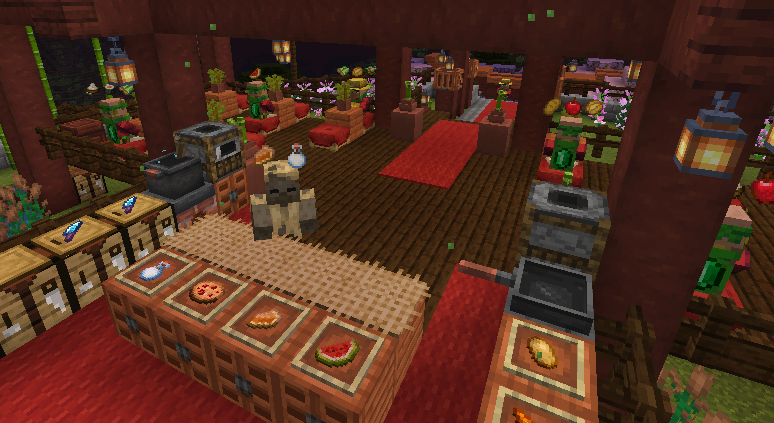

## Overview

This mod provides Customer Villagers that will spawn, decide they want to buy some items from you,
and go to where they think they can buy them from you.  Once you sell the items to them they will
pay you, say thank you, and go on their merry way.  It provides the basic villager AI, spawning blocks,
and controls to crafter and customer type gameplay experiences like a fast-paced diner or a cozy
rode-side farm stand.

## Supported Minecraft Versions

For now we support Minecraft versions:
* 1.21.1
* 1.21.11

## Mod Loader

For now we are only supporting NeoForge.

## Customer Spawner Blocks

A customer spawner block is the starting point for this mod.  Where you place it is where your
customers will spawn and what you place inside of it determines what your customers will want to
buy from you.

Customers only spawn where they have enough vertical clearance and a 2×2 surface made from solid
blocks, slabs, carpet, or stairs.

Similar to a regular mob spawner block, each customer block will try to keep up to 4 customers
spawned at any one time by default. The default maximum can be changed with the `maxCustomers`
configuration option or overridden for an individual spawner with redstone in its inventory.
Customers that are done buying and are leaving do not count toward this maximum.

During timed shifts, the customer maximum starts low, ramps up to the configured or
inventory-defined maximum, and ramps down over the final portion of the shift. The longer
Day and Night Shifts ramp up more gradually than the shorter meal shifts.

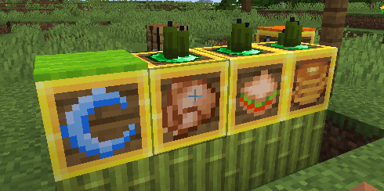

### Crafting Customer Spawner Blocks

You can craft a customer spawner block from a bed surrounded by 8 emeralds.

### Spawning Modes

The customer spawning modes are mostly around time or shifts, do you configure the spawning mode
with a Clock.  Hold a Clock and right-click the customer spawner block to cycle through the
spawning modes.  Each spawning mode change will show a message with the change and change the
block texture.

* Continuous / Default - The default mode will try to continuously keep 4 customers spawned.
* Day Shift - This mode will keep spawning customers, but only when it's daytime from
  5am - 7pm.
* Night Shift - This mode will keep spawning customers, but only when it's nighttime from
  7pm to 5am.
* Breakfast Shift - This mode will keep spawning customers from 5:30am - 10:30am -
  A little over 4 minutes.
* Lunch Shift - This mode will keep spawning customers from 11:30am - 3:30pm -
  Just under 3 1/2 minutes.
* Dinner Shift - This mode will keep spawning customers from 4:30pm - 9:00pm -
  Just under 4 minutes.
* Manual - This mode only spawns manually with a redstone pulse.

For the time restricted shift modes, the players within 64 blocks of the spawner will get
shift messages, progress bars, and a results screen showing the final score, customer totals,
total items crafted and served, and each participating player's crafted and served item counts.
The star beside a player is their served item count, while the spoon is their crafted item count.
The progress bar shows every item currently
requested, grouped by customer with yellow for normal customers, red for impatient customers,
and green for casual customers.

### Redstone and Customer Spawner

Similar to a hopper, if the Customer Spawner block is is any mode other than Manual and
is receiving power, it will turn off spawning.  This will allow you to turn off getting
new customers when you don't want to deal with them or if you want to use redstone to control
when the shifts are on.

If a Customer Spawner is in Manual mode, a redstone pulse like with a button will spawn a
customer.  This will let you completely customize the spawning with your redstone contraption.

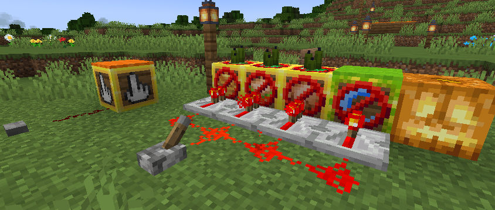

### Controlling Items For Purchase

To control the items the customers can purchase the customer spawner block also acts like
a container like a chest.  The items or stacks of items you put in the spawner are what
the customers can randomly decide to purchase.

The size of the stack is the limit to how many of that item a customer can ask to buy.
For example if you have put a single apple in the customer spawner the customer will only
ask to buy a single apple.  However, if you put a stack of 5 apples in the customer spawner,
the customer will decide to randomly buy 1 to 5 apples.

The separate 6 rows in the spawner container are used to define how many different items
a customer can decide to buy and what each of those items can be.  Each of the 6 container
rows is a "slot" for a customer to decide to buy from.  All 9 items on that row (except for
emeralds) can define an item the customer can ask for for that slot.  A customer will only
ask for one item per slot, and it will randomly decide how many slots to buy from from 1 to
the number of rows you have items in.

Emeralds are special.  Just like regular villager traders, you will be paid in emeralds.
By default, you will be payed one emerald for each item you sell to a customer.  If a
spawner container row contains a stack of emeralds, that will define how many emeralds the
items in that row cost.  Remember this will be per item not per stack so if the customer
buys more than one of the item, you will be payed that number of emeralds multiplied by
the number of items in the stack.

Redstone is also special and will not be offered to customers for purchase. The first stack
of redstone in the spawner inventory sets the maximum number of customers for that individual
spawner to the stack count. Removing all redstone returns the spawner to the `maxCustomers`
configuration value.

Examples:
* Row 1 contains just a single apple - Customer will always ask for a single apple and
  pay a single emerald
* Row 1 contains a stack of 5 apples - Customer will always ask for from 1 to 5 apples and
  pay one emerald for each
* Row 1 contains a stack of 5 applies and a stack of 5 carrots - Customer will always
  decide to buy either apples or carrots and buy from 1 to 5 of them paying one emerald
  for each.
* Row 1 contains a stack of 3 chocolate chip cookies, a single pumpkin pie, and a stack of
  2 emeralds - Customer will always decide to buy chocolate chip cookies or a pumpkin pie.
  If it decides to buy chocolate chip cookies it will buy from 1 to 3 and pay 2 emeralds
  for each cookie.  If it decides to buy a pumpkin pie it will only buy 1 and pay 2 emeralds 
  for it.
* Row 1 contains a single apple and row 2 contains a single pumpkin pie and a stack of 2
  emeralds - Customer will decide to buy from 1 to 2 items.  If it decides to only buy 1,
  it will randomly pick which row to buy from.  If it decides to buy 2, it will buy one
  item from each row.

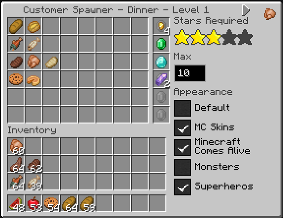

### Counter or Table-Top Blocks

Once a customer spawns, it needs to know where to go to buy the items it picked.  This is
where the counter or table-top blocks come in.  Whatever item you place on top of the
spawner will be treated as the counter or table-top block to find.  A good approach would
be to use colored carpet blocks that you are not using on the floor or other parts of your
build and put that same carpet color on the tables or counters where you want the customers
to go.  You can also use a sign with custom text that you match on the sign next to your
counter where you want customers to gather.

* Carpet or wool blocks - Matches the type and color
* Signs - Matches the wood type and text
* Containers or banners named with an anvil - Matches the block type and name
* Lecterns with a named book on them - Matches the book name
* Other items - Exact block match

Customers search for all blocks of this type within 64 blocks by default and go to a random one,
trying to avoid one that already has a customer next to it. The search distance can be changed
with the `maxCounterDistance` configuration option.

### Avoid Block

When a Customer looks for a spot to go to next to your counter or table-top blocks it will
look at all the spaces around it as options unless that block matches the block directly
under the customer spawner block.  This can be used to set of builds like a counter where
you only want the customers to go to one side of it because the other side if the kitchen.
On the other side of the counter use a different block for the kitchen tiles and put that
same kitchen floor block under the customer spawner.

## Customer Pickup Counter Blocks

Customer Pickup Counter Blocks let players split up the work of preparing and serving
customer orders. One player can prepare food or other requested items and place them on
a pickup counter while another player serves the waiting customers, or customers stationed
at pickup counters can collect their prepared items directly.

Placing a requested item on a pickup counter gives crafting credit to the player who
prepared it when a Customer Spawner is within a 64 by 64 by 64 area. If the full stack is
not currently needed, the counter remembers who prepared the remaining items. Those items
are checked again when another matching stack is added, and any later crafting credit
still goes to the original crafter.

Each pickup counter holds up to 9 item stacks. The stored items are displayed on top
of the block, so players can see what is ready without opening an inventory screen. Items
are handled in first-in, first-out order: the item that has been waiting the longest is
the first one taken from the counter.

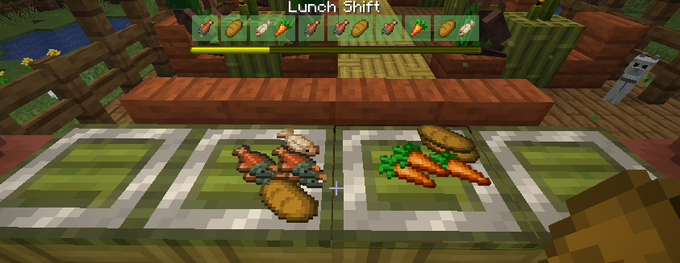

### Crafting Customer Pickup Counter Blocks

Craft a pickup counter with a horizontal row containing one iron ingot followed by two
matching variant ingredients:

```text
Iron Ingot | Variant Ingredient | Variant Ingredient
```
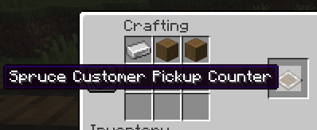

The following variants are available:

* Iron, made with two additional iron ingots
* Copper, made with two copper ingots
* Gold, made with two gold ingots
* Oak, spruce, birch, jungle, acacia, dark oak, mangrove, and cherry, made with two
  matching stripped logs
* Crimson and warped, made with two matching stripped stems
* Bamboo and stripped bamboo, made with two matching full bamboo blocks

Each variant uses the matching block texture, so pickup counters can be coordinated with
the materials and decoration used in a kitchen, restaurant, shop, or market stand.

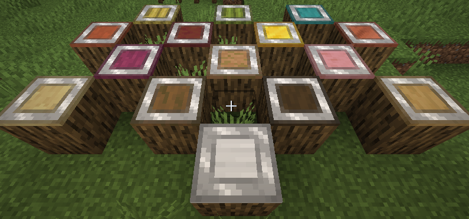

### Placing and Taking Items

Right-click a pickup counter while holding an item stack to place the entire held stack
onto the counter. Sneak-right-click while holding a stack to place only one item. Right-click
with an empty hand to take the entire oldest stack, whether or not you are sneaking. The counter
does not open an inventory screen; all item handling happens directly through these
interactions.

Pickup counters accept only items currently wanted by active customers. If customers want
only part of a held stack, that portion is placed on the counter and the rest remains in the
player's hand. Items that no active customer wants remain in the player's hand.

Once each second, a waiting customer at a pickup counter tries to collect one of their
remaining requested items. The counter must contain the full requested amount in a single
stack. The customer takes only the requested amount when the stored stack contains more,
and the player who originally placed that stack receives credit for serving those items.
Empty containers such as bottles, buckets, and bowls are returned to that player. If the
player is offline, the containers are dropped on top of the pickup counter.

If all 9 spaces are occupied, the item remains in the player's hand and a message explains
that the pickup counter is full.

Pickup counters regularly check whether their stored items are still needed. Items that are
no longer needed are returned to the player who placed them. If that player's inventory is
full, the remaining items are dropped on top of the pickup counter and the player receives
a message. The player keeps the crafted-item credit earned when the items were first accepted.
Breaking a pickup counter drops all of the items stored on it, so prepared items are not
lost when a counter is moved.

### Connecting Pickup Counters

Pickup counters that touch on their north, south, east, or west sides work together as one
larger pickup area. Diagonally placed counters and counters above or below each other are
not connected.

When a player places an item on a full counter, the item is passed to an available connected
counter. This continues through an entire connected row or group of counters until a space
is found. If every connected counter is full, the item stays in the player's hand.

When a player tries to take an item from an empty counter, it searches its connected
neighbors and returns the oldest available item it finds. This lets players add and collect
prepared items from a convenient end of a long pickup counter without interacting with
each individual block.

## Villager Customers

The Customer Spawner will spawn Customer Villagers that are just normal villagers with
custom AI and a custom profession.  The Customer profession give them a unique skin and
hat so you can tell they are customers.  There are 3 types of customers:

* Normal - ~50% of spawned - Will give up at the configured max seconds.
* Impatient - ~ 20% of spawned - Will give up at half of the configured seconds.
* Casual - ~30% of spawned - Will never give up.

Each wears a different hat:

|                       Normal                        |                         Impatient                         |                       Casual                        |
|:---------------------------------------------------:|:---------------------------------------------------------:|:---------------------------------------------------:|
| 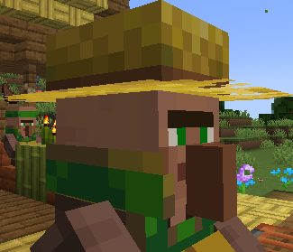 | 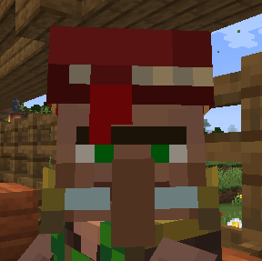 | 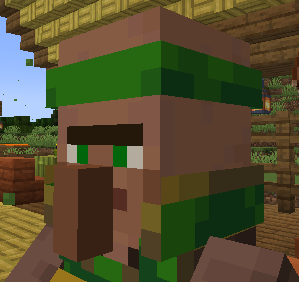 |


If you want your customers to have names, think about using the [Villager Names mod](https://www.curseforge.com/minecraft/mc-mods/villager-names).

### Special Night Shift Customers

If the Customer Spawner Block has a lit jack-o-lantern block next to it and the spawner
mode is on Night Shift, it will also randomly spawn the monster customers which are just
like the villager customers but on the client side will show up and sound like friendly
zombies, skeletons, witches, pillagers, vindicators, evokers, and illusioners.

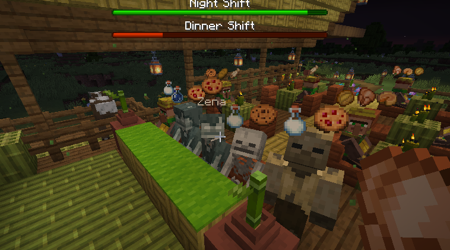

### Picking Items to Buy

The first thing a customer will do it look at it's spawner to pick what items it wants to
buy.  See [Controlling Items For Purchase](#Controlling Items For Purchase).

### Going to the Counter or Table

Once it has picked items to buy, it needs to find where to buy them.
See [Counter or Table-Top Blocks](#Counter or Table-Top Blocks).
Once the customer has found all the matching blocks, it will shuffle the list and then
sort it ascending by the number of customers within 2 blocks of it.  It will then pick
the first one which should be a random block with the fewest number of other customers
near it.  This should give a nice pattern of filling our a counter or restaurant full
of tables.
Customers prioritize available stairs and seat-like blocks near counters and will sit while waiting to be served.

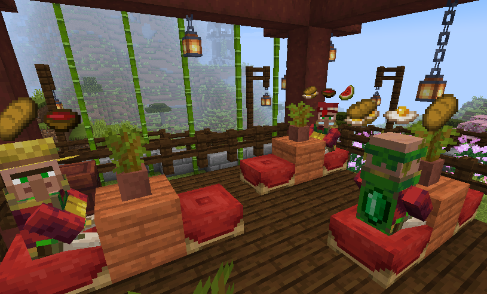

If there are more customers than there are counters, the customers will line up and
wait their turn:

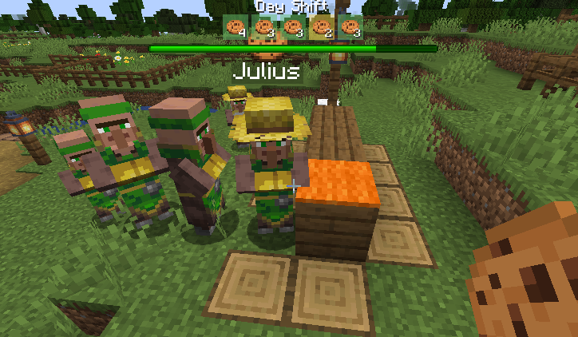

### Serving and Selling to the Customer

You will serve the customer what they want or sell them what they want to buy just like
any other villager trader.  Right click on them to open up the trade and sell them one
of the items.  After being sold one of the items they want, that item will be removed
from the trades.

Quick selling can be enabled with the `enableQuickSell` configuration option. When enabled,
right-clicking a customer while holding enough of a wanted item in your main hand immediately
completes one matching sale instead of opening the trading screen.

### Thank You and Goodbye

Once the customer's trade list is empty they will say thank you and goodbye to you in
chat and walk back to the spawner that created them.  Once they reach the spawner they
will pick a random block to walk to 32 blocks away that has 2 air blocks above it and
that they can actually path to.  They will then walk to this block and once they get
there despawn.

## Gameplay and Shifts

If your Customer Spawner Block is ser to a mode other than Continuous and Manual,
you and other players will be working within shifts that have a start and end.  You
will get a progress bar that shows the shift, a progress bar that ticks down to the
end, and a heads up view of what all active customers want for that shift.

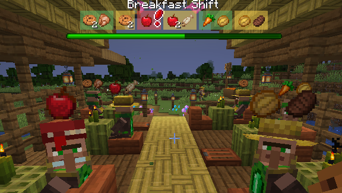

At the end of the shift you and the other players will get a scoreboard showing
how well you did:

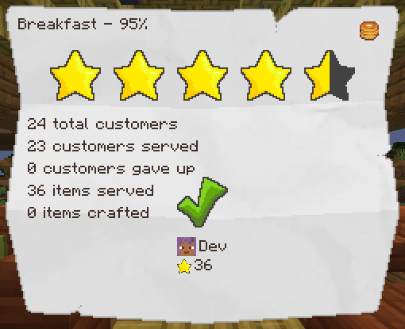

## Supplier Spawner Block

A Supplier Spawner Block can be used to setup a Supplier that will show up at the beginning
of the day will new supplies to buy for your restaurant or stand when you can't or don't
want to gather them your self.  Lets say your Customers want steaks, but you don't want
to harvest a bunch of cows.  That's where a Supplier can help you out.

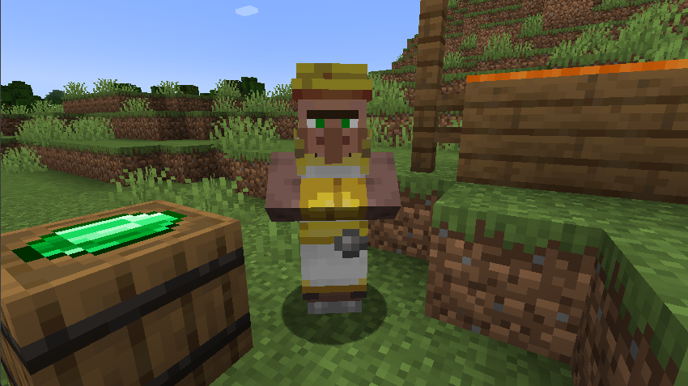

### Crafting Supplier Spawner Blocks

You can craft a supplier spawner block from a barrel surrounded by 8 emeralds.

### Specifying What the Supplier Will Sell

The supplier spawner block acts like a double-chest container and the items you put in it,
including the size of the stack, will be what the supplier will sell you.  Similar to the
customer spawner blocks, the exception is emeralds.  Emeralds are used to set the price of
the items the supplier will sell.  The Supplier will default to 1 emerald per stack of items,
but if you put a stack of emeralds after each of the items in the container, that will set
the price to the count of emeralds.  For example if you put a stack of 32 raw steaks in the
container and in the next slot put 5 emeralds, the supplier will sell you 32 raw steaks for
5 emeralds.

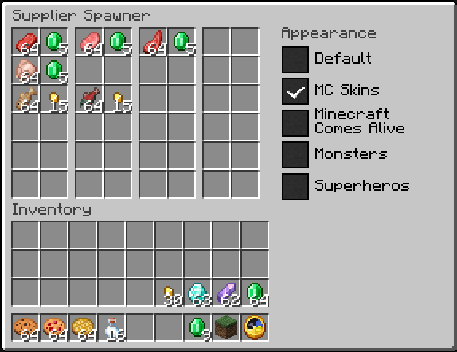

### Supplier Spawning

The Supplier will spawn each morning up to 64 blocks away from the spawner at a position
from which it can walk back to the spawner. Once the Supplier is there you can start buying items.

Suppliers only spawn where they have enough vertical clearance and a 2×2 surface made from solid
blocks, slabs, carpet, or stairs.

Once it is dark the Supplier will walk away and despawn.

## Build Commands

Build commands provide information about customer and supplier spawners near the player. They are
disabled by default and can be enabled with the `enableBuildCommands` configuration option.

* `/suppliers spawners` lists supplier spawners in a 64x64 area centered on the player and
  shows whether each spawner is enabled.
* `/customers spawners` lists customer spawners in a 64x64 area centered on the player and
  shows whether each spawner is enabled and its spawning mode.
* `/customers spawners counters` also lists the matching counter blocks found for each customer
  spawner and displays a rotating mode icon above each counter for 90 seconds.

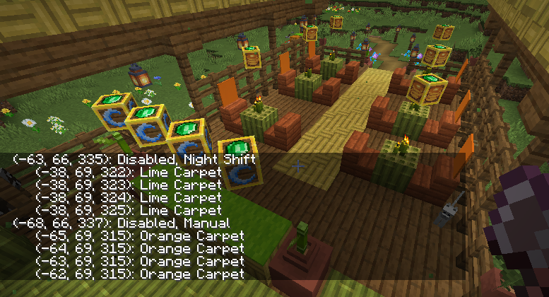

## Configuration

| Name | Config property | Description | Default |
| --- | --- | --- |---------|
| Customer Spawner Recipe | `enableCustomerSpawnerBlockRecipe` | Enables the crafting recipe for the Customer Spawner Block. | `true`  |
| Supplier Spawner Recipe | `enableSupplierSpawnerBlockRecipe` | Enables the crafting recipe for the Supplier Spawner Block. | `true`  |
| Maximum Counter Distance | `maxCounterDistance` | Sets the maximum distance in blocks between a Customer Spawner and the counters its customers can find. | `64`    |
| Maximum Customers | `maxCustomers` | Sets the maximum number of customers that each Customer Spawner tries to keep spawned. | `4`     |
| Customer Give Up Seconds | `customerGiveUpSeconds` | Sets how many seconds a customer waits without completing a trade before giving up and leaving. | `120`   |
| Enable Build Commands | `enableBuildCommands` | Enables the customer and supplier build inspection commands. | `false` |
| Enable Quick Sell | `enableQuickSell` | Enables selling directly to a customer by right-clicking while holding enough of a wanted item in the main hand. | `false` |
